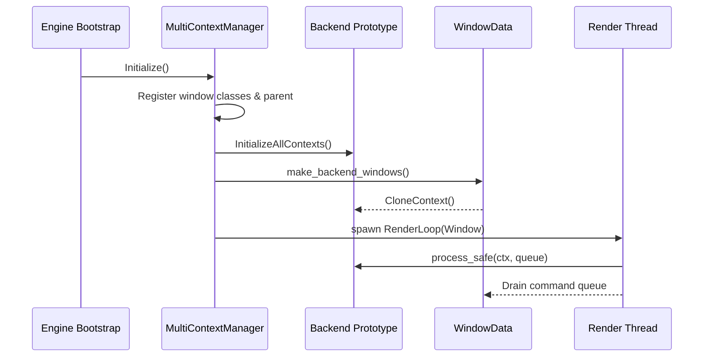
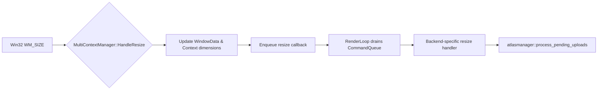

# AlmondShell Engine Analysis

## Architecture Highlights
- **Configurable Runtime Flags** – `include/aengineconfig.hpp` centralises renderer and context toggles (SDL, Raylib, OpenGL, software renderer) alongside headless/WinMain entry-point switches, making it the primary control surface for build-time composition.
- **Versioned Core** – `include/aversion.hpp` exposes inline getters for the semantic version components, enabling compile-time inspection of the running revision.
- **Context Management** – `src/acontext.cpp` and `include/acontextmultiplexer.hpp` orchestrate the per-backend render contexts and their window lifecycles, while `include/acontextwindow.hpp` encapsulates platform window data.
- **Hot-Reload Pipeline** – `src/ascriptingsystem.cpp` drives compilation and loading of `.ascript.cpp` files via the task graph scheduler, handing control to `ScriptScheduler` nodes created in `include/ascriptingsystem.hpp`.

## MultiContextManager Startup Sequence

1. **Bootstrap Win32 scaffolding.** `MultiContextManager::Initialize` registers parent/child window classes, seeds all context prototypes via `InitializeAllContexts`, and creates the optional parent docking window together with a dummy OpenGL context that owns shared resources used during `wglShareLists` calls.【F:AlmondShell/src/acontextmultiplexer.cpp†L309-L392】【F:AlmondShell/src/acontextmultiplexer.cpp†L395-L429】【F:AlmondShell/src/acontext.cpp†L431-L520】
2. **Instantiate backend windows.** The inline `make_backend_windows` helper allocates Win32 child shells, looks up the backend’s `BackendState`, clones prototype `Context` objects with `CloneContext`, and binds each clone to a fresh `WindowData`. This pass also hands backend-specific initialisers (SDL, Raylib, SFML, OpenGL, software) the correct HWND/size pairing before adopting backend-managed windows when needed.【F:AlmondShell/src/acontextmultiplexer.cpp†L431-L587】【F:AlmondShell/src/acontext.cpp†L365-L426】
3. **Bind live windows.** The public `AddWindow` path mirrors the initialization routine for dynamically attached windows: it ensures pixel formats, fetches or clones a backend `Context`, hooks up the `WindowData` bi-directional pointers, and records the size so resize callbacks and command queues can be wired immediately.【F:AlmondShell/src/acontextmultiplexer.cpp†L602-L736】【F:AlmondShell/include/awindowdata.hpp†L19-L79】
4. **Launch render threads.** When a window is registered (either during startup or later) the manager spawns a dedicated thread that runs `RenderLoop`. The thread calls `SetCurrent`, performs backend initialization, repeatedly invokes `Context::process_safe`, and drains the window’s `CommandQueue` until shutdown.【F:AlmondShell/src/acontextmultiplexer.cpp†L736-L820】【F:AlmondShell/src/acontextmultiplexer.cpp†L980-L1065】【F:AlmondShell/src/acontext.cpp†L117-L198】
5. **Maintain active context tracking.** Each render loop keeps `WindowData::context` and `Context::windowData` in sync so other systems (menu, atlas manager) can enqueue render-safe work or query dimensions without touching Win32 handles directly.【F:AlmondShell/src/acontextmultiplexer.cpp†L510-L692】【F:AlmondShell/include/acontext.hpp†L41-L159】

## Context State During Resizes and Atlas Uploads

### Resize propagation flow

| Trigger | Shared `Context` / `WindowData` effect | Raylib backend reaction | SDL backend reaction |
| --- | --- | --- | --- |
| `WM_SIZE` on a child window | `HandleResize` clamps the client size, updates both `WindowData::width/height` and the owning `Context`, and pushes a resize callback into the per-window `CommandQueue` so it executes on the render thread.【F:AlmondShell/src/acontextmultiplexer.cpp†L782-L820】 | `raylibcontext::dispatch_resize` coalesces resize storms, adjusts both framebuffer and logical dimensions, mirrors the virtual canvas into `Context::width/height`, and applies native HWND and Raylib window resizes only when required.【F:AlmondShell/include/araylibcontext.hpp†L62-L166】 | `sdl_process` re-queries the renderer output size every frame, pushes the resolved dimensions back into the shared `Context`, and mirrors them into the SDL renderer before draining queued commands.【F:AlmondShell/include/asdlcontext.hpp†L231-L309】 |
| Render thread iteration | `RenderLoop` calls `Context::process_safe`, keeping the window alive while draining queued lambdas from `CommandQueue` (including resize callbacks).【F:AlmondShell/src/acontextmultiplexer.cpp†L996-L1065】 | The Raylib backend’s process loop updates viewport scaling and mouse transforms before returning control, so GUI coordinates align with the resized canvas.【F:AlmondShell/include/araylibcontext.hpp†L167-L260】 | SDL’s loop clears/presents via `SDL_Renderer`, maintaining parity between logical canvas size and the context-provided dimensions.【F:AlmondShell/include/asdlcontext.hpp†L231-L309】 |
| Atlas upload request | `Context::add_atlas_safe` delegates to `AddAtlasThunk`, which ensures the atlas is staged and marks pending uploads for every backend; the shared `BackendState` keeps versioned upload bookkeeping.【F:AlmondShell/src/acontext.cpp†L147-L199】【F:AlmondShell/include/acontext.hpp†L108-L178】 | Raylib registers its uploader via `atlasmanager::register_backend_uploader`, which later drives `raylibtextures::ensure_uploaded` when the render thread flushes pending tasks.【F:AlmondShell/src/acontext.cpp†L565-L585】【F:AlmondShell/include/araylibcontext.hpp†L112-L138】 | SDL performs the same dance, registering `sdltextures::ensure_uploaded` so uploads execute once the renderer thread calls `atlasmanager::process_pending_uploads(ContextType::SDL)`.【F:AlmondShell/src/acontext.cpp†L504-L543】【F:AlmondShell/include/asdlcontext.hpp†L206-L264】 |

## Render Data Flow: `process_safe`, atlas thunks, and the scheduler

`Context::process_safe` is the choke point that render threads and the main thread use to run backend update loops while shielding the engine from exceptions. Each backend process implementation invokes `atlasmanager::process_pending_uploads(type)` before draining the per-window `CommandQueue`, ensuring any `AddTextureThunk`/`AddAtlasThunk` calls queued by game systems are serviced while the correct graphics context is bound.【F:AlmondShell/src/acontext.cpp†L117-L205】【F:AlmondShell/src/acontext.cpp†L205-L311】 The thunks convert high-level atlas operations into backend-specific upload calls, then hand control back to `atlasmanager`, which tracks pending versions per backend and executes the registered uploader on the active render thread.【F:AlmondShell/src/acontext.cpp†L148-L199】【F:AlmondShell/include/aatlasmanager.hpp†L338-L409】

Asset producers can run off the main thread via the coroutine-enabled `taskgraph::TaskGraph`. Systems such as the sprite pool schedule allocation jobs on the graph; once work completes they enqueue render-safe lambdas (for example atlas uploads) into the owning window’s `CommandQueue`. The render thread then resumes, calls `process_safe`, flushes atlas uploads, and drains queued commands, giving a deterministic hand-off from background workers to GPU submission.【F:AlmondShell/include/ataskgraphwithdot.hpp†L24-L124】【F:AlmondShell/include/aspritepool.hpp†L120-L189】【F:AlmondShell/src/acontextmultiplexer.cpp†L996-L1065】

## Observed Gaps
- **Fragile Script Loading** – Before this update, missing script sources or compilation artefacts would silently cascade into load failures. The scripting system now validates inputs and outputs before attempting to load DLLs.
- **Roadmap Traceability** – The existing `roadmap.txt` lacked granular prompts or acceptance checks per phase, making automation hand-offs hard to script.
- **Testing Surface** – No automated smoke tests or CI hooks are defined for the critical updater and renderer paths, leaving regression risk high during phase transitions.

## Recent Progress (v0.71.0)

- Established the C++23/module baseline, refreshed the build documentation with module-scanning flags (`CMAKE_CXX_SCAN_FOR_MODULES`/`CMAKE_EXPERIMENTAL_CXX_MODULE_DYNDEP`), and bumped the public metadata so downstream packagers configure BMI-aware toolchains consistently for the v0.71.0 snapshot.

## Recent Progress (v0.62.0)

- Routed the `--update` command through the modular updater entrypoint so the launcher checks availability by default and only applies builds when invoked with `--force`, paving the way for in-engine update menus while ensuring forced runs hydrate the full source tree beside the binary for inspection and rebuilds.
- Raylib caches its virtual-fit viewport each frame and reprojects atlas sprites through that transform, eliminating the clipping and drifting that previously affected menu buttons in letterboxed windows.
- SDL3 keeps its context dimensions in lockstep with the renderer output size so GUI layouts always see the correct canvas and remain visually centered after resizes.
- The menu overlay now honours a configurable column cap (defaulting to four via `--menu-columns`), preventing overly wide grids while still allowing narrower layouts for constrained displays.

## Recent Progress (v0.60.0)
- Raylib now mirrors its internal viewport offset when drawing atlas-backed GUI sprites and when scaling mouse input, so letterboxed windows keep buttons aligned with their visual positions.
- SDL3 rendering queries the active viewport before mapping normalized GUI coordinates, ensuring atlas-driven overlays remain centered when logical presentation introduces padding.

## Recent Progress (v0.59.10)
- Introduced `agui.hpp` as a backend-agnostic immediate mode GUI layer that seeds a shared atlas and drives Raylib/SDL draw calls through the existing sprite pipeline, giving every context text and button primitives out of the box.

## Recent Progress (v0.59.9)
- Stabilised Raylib UI scaling across docked and standalone windows by preserving logical dimensions alongside framebuffer sizes, so atlas-driven GUI buttons keep their intended proportions after DPI-aware resizes in the Raylib backend.

## Recent Progress (v0.59.8)
- Adopted backend-owned Raylib and SDL window handles inside the multiplexer, replacing the temporary shell HWNDs with the real
  render surfaces so docking keeps working without spawning blank white host windows.
- Normalised Raylib GUI scaling by driving sprite metrics from the framebuffer-to-context ratio, keeping menu buttons sized with
  the window instead of shrinking as the viewport grows.

## Recent Progress (v0.59.3)
- OpenGL quad draws now always rebuild the shared shader/VAO pipeline on demand and purge GPU atlases through the active backend data, keeping texture uploads live across context churn on Linux and Windows.
- The immediate-mode GUI skips rendering whitespace quads while preserving advance metrics so font spacing stays stable across atlas implementations.
- Raylib viewport math now uses the design-space reference dimensions when normalised GUI coordinates are supplied, aligning overlay widgets with the letterboxed canvas instead of the raw framebuffer size.
- Cached narrow window titles alongside HWND handles in the multiplexer so SDL and Raylib initialisers can read consistent UTF-8
  names when contexts spawn, fixing the Windows build regression caused by the loop-scoped `narrowTitle` identifier.

## Recent Progress (v0.59.1)
- The Raylib backend now coalesces OS-driven resize events and forwards them through guarded callbacks, keeping context dimensions and client hooks in sync with the window manager.

## Recent Progress (v0.59.0)
- The Win32-specific multi-context manager is now compiled only on Windows, and a portable stub keeps non-Windows builds linking while the docked UI remains a platform-specific feature.
- `awindowdata.hpp` no longer drags in `<windows.h>` on every platform, replacing the raw handle types with lightweight aliases so headless tools and POSIX builds stop failing during preprocessing.

## Recent Progress (v0.58.3)
- `RunEngine()` now launches the same multi-context render loop that powers `wWinMain`, letting non-Windows entry points exercise
  the full renderer/task orchestration stack without stubbing out the runtime.
- The Win32 bootstrap delegates to a shared helper so there is a single source of truth for context startup, menu routing, and
  scene lifecycle management.

## Recent Progress (v0.58.2)
- Version helpers now use thread-local buffers and expose string views, making it safe to query build metadata from concurrent tools.
- Updater configuration derives its semantic version directly from the version helpers, eliminating manual sync errors.
- Added `docs/aengineconfig_flags.md` to catalogue supported engine configuration switches for multi-backend builds.

## Recent Progress (v0.58.0)
- Added `ScriptLoadReport` to expose per-stage reload diagnostics, capture failure reasons, and emit success flags for automation to consume.
- Task graph workers now destroy coroutine frames after execution and prune completed nodes, preventing latent reload handles from accumulating between runs.
- Script reload orchestration awaits completion synchronously, guaranteeing that editors and tooling observe a consistent state before proceeding.

## Recommended Focus Areas
1. **Viewport Regression Harness** – Capture golden images for Raylib, SDL3, and software renderers to lock in the new fit-viewport logic and catch drift before it reaches production builds.
2. **Shared Layout Utilities** – Centralise the letterbox-aware size helpers so every backend (and future UI code) consumes the same conversion logic instead of duplicating clamps in multiple files.
3. **Menu Configuration UX** – Surface the new `--menu-columns` knob inside in-engine settings so column limits can be adjusted without restarting, then validate keyboard/gamepad navigation against dynamic changes.
4. **Cross-Context Resize Telemetry** – Instrument resize callbacks to log logical vs framebuffer dimensions, making it easier to diagnose when a backend falls out of sync with the multiplexer’s expectations.

## Context Cleanup Watchlist
- See `docs/context_audit.md` for a full census of "context" modules.  With the deprecated Win32 and Vulkan GLFW shims removed, `include/acontextrenderer.hpp` remains the lone "maybe" pending deeper archaeology.

## Next-Step Prompt Template
> "You are advancing AlmondShell through Phase {N} of the roadmap. Inspect the outstanding tasks for this phase, create a mini plan listing concrete PR-sized steps, implement them, and return a report with code diffs, tests, and docs updated."

Use this template alongside the refreshed roadmap to keep future assistant runs aligned with the delivery cadence.
