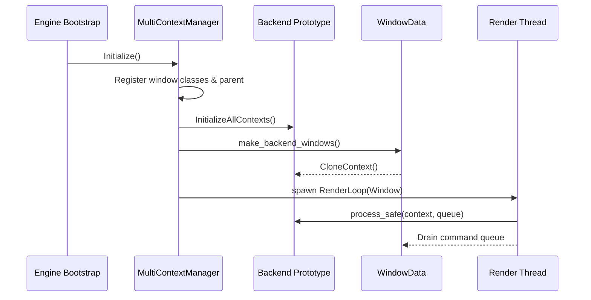
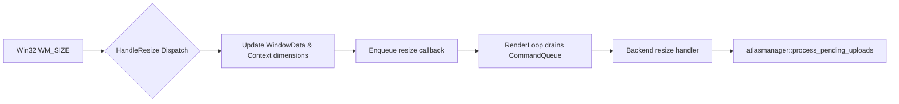
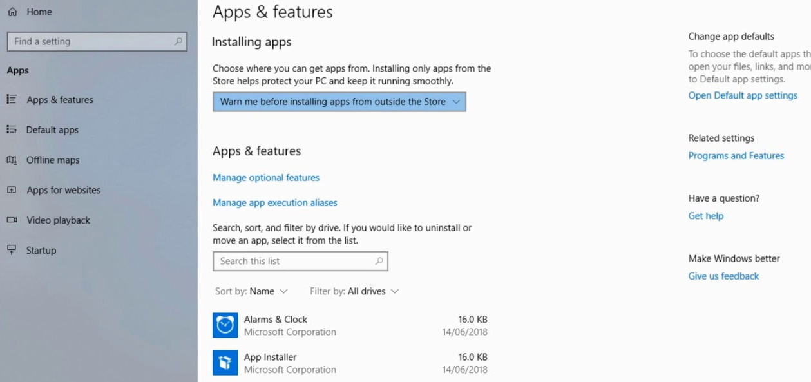

# AlmondShell

**AlmondShell** is a modern **C++23, modules-first software engine** that forms the foundation layer for the evolving AlmondEngine project.
It distils over **4,000 hours** of engineering effort invested into getting a multi-context, multi-threaded, fully featured atlas system working—resulting in a flexible runtime that can:

- Substitute AlmondEngine's Vulkan and DirectX layers with multiple 2D graphics back-end contexts.
- Host entire engines such as **SDL3**, **SFML**, and **Raylib** inside a multi-threaded, multi-context environment with fine-grained configuration control.
- Provide its own internal OpenGL, software, and no-op renderers alongside headless execution modes.
- Offer state-of-the-art networking via Steam servers with automatic ASIO fallback.

The runtime is designed for rapid iteration with hot-reloadable scripting, a self-updating launcher capable of downloading and building from source, and the low-level systems that power rendering, scripting, task scheduling, and asset pipelines. Editor automation currently lives in `src/scripts/`, which the runtime watches and reloads on demand.

---

## Architectural Pillars

- 🧱 **Static Linking First**
  AlmondShell's runtime is delivered as a fully static target, ensuring deterministic deployment, predictable performance, and portability across distribution channels.
- 📚 **Header-Only Core**
  The primary engine modules live in headers so they can be inlined, composed, and consumed without linker gymnastics, unlocking rapid iteration for integrators.
- 🧠 **Functional Flow**
  Systems are composed in a functional style that favours pure interfaces and immutable data where possible, simplifying reasoning about complex runtime state.

---

## Runtime Flow

The multi-context runtime spins up several cooperating systems during process startup. The following diagram walks through how the engine bootstrap seeds backend prototypes, clones contexts, and dispatches render threads. For a deeper, annotated breakdown see [`AlmondShell/docs/engine_analysis.md`](AlmondShell/docs/engine_analysis.md).



Resizes, atlas uploads, and render-thread callbacks are orchestrated through the multiplexer so every backend stays in sync. The flowchart below summarises how Win32 resize messages travel through shared `Context`/`WindowData` state before landing in backend-specific handlers. Refer to the engine analysis document for exhaustive call-site notes and per-backend nuances.



---

## Current Snapshot (v0.71.0)

- ✅ **C++23 module baseline** – The codebase now targets C++23, and the documentation outlines the module-aware configuration flags needed to rebuild with BMI scanning enabled across CMake presets and helper scripts.
- ✅ **Module migration guidance** – Fresh-build steps now call out when to clear cached CMake state, how to enable module dependency scanning (`CMAKE_CXX_SCAN_FOR_MODULES`/`CMAKE_EXPERIMENTAL_CXX_MODULE_DYNDEP`), and which compilers have been validated for the milestone.
- ✅ **Updated toolchain requirements** – Prerequisites have been raised to module-capable compilers (VS 2022 17.10+, clang 17+, GCC 14+) and CMake releases with first-class module support so downstream packagers avoid partial BMI generation.
- ✅ **Documentation refresh** – Version metadata, the engine analysis brief, and the configuration flag guide are aligned on the v0.71.0 snapshot and the module-focused release notes.

Refer to [`Changes/changelog.txt`](Changes/changelog.txt) for the full history of fixes and enhancements.

---

## Key Features

- 🔄 **Self-updating launcher**
  Designed to automatically fetch the newest release when run, or perform an on-demand check via `--update` before applying builds with `--force`.
  When you force an update the bundled updater downloads the matching source archive, expands it next to the executable, and rebuilds the binary so you can inspect or extend the engine even when starting from a published release.
  Can also be built directly from source for full control.

- ⚙️ **Modular C++23 engine**
  Built in a **functional, header-only + module-first style** with static linkage.
  Context-driven architecture with systems for rendering, windowing, input, scripting, tasks, and asset management.

- 🧪 **Live script reloading**
  Changes to `*.ascript.cpp` files are detected at runtime, recompiled with LLVM/Clang, and seamlessly reloaded.

- 🗂️ **Well-organised codebase**
  - Headers in `include/`
  - Implementation in `src/`
  - Helper scripts under `unix/` plus project-level `.sh` helpers

- 🖼️ **Sprite & atlas management**
  Global registries, unique atlas indexing, and atlas-driven GUI (buttons, highlights, and menus) backed by the multi-context atlas pipeline that has been refined over thousands of development hours.
- 🪟 **Built-in immediate GUI (`agui.hpp`)**
  Shared GUI primitives provision a font atlas automatically, upload it to Raylib and SDL backends, and expose ready-made buttons, text inputs, image buttons, and console widgets so every context can draw the same HUD elements out of the box.

- 🖥️ **Multi-context rendering**
  Pluggable backends: OpenGL, Raylib, SFML, and a software renderer — switchable via thunks and lambdas.
  **Multithreaded** with a state-of-the-art **hybrid coroutine + threaded design** for maximum scalability and efficiency.
  Docked child windows now display backend labels so it's obvious which renderer owns each pane when SDL and Raylib run side by side.

---

## Status

✅ **Actively Developed**
AlmondShell is under **active development** as the software engine base of AlmondEngine.
The current focus is **Phase 2 of the roadmap**: hardening the multi-context runtime, building renderer smoke coverage, and integrating automated reload diagnostics.
See [`Changes/roadmap.txt`](Changes/roadmap.txt) and [`AlmondShell/docs/engine_analysis.md`](AlmondShell/docs/engine_analysis.md) for the detailed plan and analysis notes.

---

## Repository Layout

```
.
├── LICENSE                  # LicenseRef-MIT-NoSell terms for AlmondShell
├── README.md                # Project overview and setup guide (this file)
├── AlmondShell/
│   ├── include/             # Core engine headers
│   ├── src/                 # Engine, updater entry point, and scripts
│   ├── docs/                # Engine analysis, configuration matrix, context audit, tooling notes
│   ├── examples/            # Sample projects and templates
│   └── CMakeLists.txt       # Build script for the updater target
├── AlmondShell.sln          # Visual Studio solution for Windows developers
├── Changes/                 # Roadmap and changelog snapshots
└── Images/                  # Non-code repository assets (logos, promo art, etc.)
    ├── 567.jpg
    └── almondshell.bmp
```

Refer to `AlmondShell/docs/file_structure.txt` for a more exhaustive tour of the available modules and helper tooling, and `AlmondShell/docs/tools_list.txt` for environment prerequisites.

## API Documentation

The repository ships with a [Doxygen](https://www.doxygen.nl/) configuration that indexes every public header beneath `AlmondShell/include/` and emits an HTML reference under `AlmondShell/docs/api/html/`.

- Run the standard build helper (`./AlmondShell/build.sh <gcc|clang> <Debug|Release>`) and the script will invoke the documentation target automatically whenever Doxygen is available on your system.
- Alternatively, generate the reference manually from an existing build tree via `cmake --build <build directory> --target docs`.
- Publish the resulting HTML directory (for example by pointing GitHub Pages at `docs/api/html/`) to keep the roadmap's documentation milestone marked as complete.

---

## Engine Configuration (`include/aengineconfig.hpp`)

AlmondShell centralises its build-time feature flags inside
[`include/aengineconfig.hpp`](AlmondShell/include/aengineconfig.hpp). The file
controls which entry points, contexts, and renderers are compiled into the
runtime:

- **Entry point selection** – Define `ALMOND_MAIN_HANDLED` if you provide your
  own `main` function. On Windows the engine automatically switches to
  `WinMain` (`ALMOND_USING_WINMAIN`) unless you opt into headless mode via
  `ALMOND_MAIN_HEADLESS`.
- **Debug toggles** – Commented-out switches such as `DEBUG_INPUT`,
  `DEBUG_TEXTURE_RENDERING_VERBOSE`, and related macros can be enabled when you
  need additional logging during development.
- **Window topology** – `ALMOND_SINGLE_PARENT` (enabled by default) tells the
  runtime to create child windows beneath a single parent. Set it to `0` to
  allow multiple top-level windows.
- **Context backends** – Enable or disable integrations like `ALMOND_USING_SDL`,
  `ALMOND_USING_SFML`, or `ALMOND_USING_RAYLIB` to embed those engines as
  AlmondShell contexts.
- **Rendering backends** – Choose one or more renderers. OpenGL is enabled out
  of the box via `ALMOND_USING_OPENGL`; additional options include
  `ALMOND_USING_SOFTWARE_RENDERER`, `ALMOND_USING_VULKAN`, and the placeholder
  `ALMOND_USING_DIRECTX` flag.
- **Raylib integration notes** – When `ALMOND_USING_RAYLIB` is enabled the
  configuration defines `RAYLIB_NO_WINDOW` and remaps select symbols (e.g.
  `CloseWindow`, `ShowCursor`, `LoadImageW`) before including `raylib.h` to avoid
  Windows header conflicts.

Review and adjust these switches before building to tailor the engine to your
toolchain and desired runtime footprint.

---

## Prerequisites

To build AlmondShell from source you will need the following tools:

| Requirement            | Notes |
| ---------------------- | ----- |
| A C++23 toolchain with module support | Visual Studio 2022 17.10+, clang 17+, or GCC 14+ are recommended so BMI generation and import scanning work reliably. |
| CMake ≥ 3.29           | Required for out-of-the-box module scanning. When using 3.27–3.28 enable either `-DCMAKE_CXX_SCAN_FOR_MODULES=ON` or `-DCMAKE_EXPERIMENTAL_CXX_MODULE_DYNDEP=ON` to drive BMI discovery. |
| Ninja _or_ MSBuild     | Pick the generator that matches your platform. Ninja is recommended with module builds to keep BMI scanning incremental. |
| Git                    | Required for cloning the repository and fetching dependencies. |
| [vcpkg](https://vcpkg.io/) | Simplifies acquiring third-party libraries listed in `AlmondShell/vcpkg.json`. |
| Optional: Vulkan SDK   | Needed when working on Vulkan backends listed in `include/avulkan*`. |

### vcpkg manifest dependencies

AlmondShell ships with a [vcpkg manifest](AlmondShell/vcpkg.json) so that CMake can automatically fetch all required third-party
packages when you configure the project in manifest mode (`VCPKG_FEATURE_FLAGS=manifests`). Visual Studio 2022 picks this up automatically when you open the `AlmondShell` folder, restoring the dependencies during the first configure step (ensure **Tools → Options → CMake → vcpkg** has *Use vcpkg manifest mode* enabled if you have previously customised the setting). The manifest currently pulls in:

- [`asio`](https://think-async.com/) – Asynchronous networking primitives used by the updater and runtime services.
- [`fmt`](https://fmt.dev/) – Type-safe, fast formatting for logging and diagnostics.
- [`glad`](https://glad.dav1d.de/) – OpenGL function loader now linked unconditionally so Linux builds keep `gladLoadGLLoader` available even when Raylib is active.
- [`glm`](https://github.com/g-truc/glm) – Mathematics library for vector and matrix operations.
- [`opengl`](https://www.khronos.org/opengl/) – OpenGL utility components supplied by vcpkg.
- [`raylib`](https://www.raylib.com/) – Optional renderer and tooling integrations.
- [`sfml`](https://www.sfml-dev.org/) – Additional windowing and multimedia support.
- [`sdl3`](https://github.com/libsdl-org/SDL) and [`sdl3-image`](https://github.com/libsdl-org/SDL_image) – Cross-platform window,
  input, and image loading.
- [`zlib`](https://zlib.net/) – Compression support for packaged assets and downloads.

If you are using a classic (non-manifest) vcpkg workflow, install the same packages manually before configuring CMake, for example:

```bash
vcpkg install asio fmt glad glm opengl raylib sfml sdl3 sdl3-image zlib
```

### Linux build quickstart

1. **Install system prerequisites** (Ubuntu/Debian example):
   ```bash
   sudo apt update && sudo apt install build-essential clang ninja-build cmake pkg-config
   ```
2. **Restore dependencies via manifest mode** (optional helper shown if you have not bootstrapped vcpkg yet):
   ```bash
   ./AlmondShell/unix/bootstrap-vcpkg.sh
   ./vcpkg/vcpkg install --triplet x64-linux
   ```
   CMake will reuse the manifest to pull `glad`, `raylib`, `SDL3`, and the other declared libraries on the first configure run.
3. **Configure and build** (start from a clean build directory so BMI files are regenerated):
   ```bash
   rm -rf build/linux-clang
   cmake -S AlmondShell -B build/linux-clang -G Ninja -DCMAKE_BUILD_TYPE=Release -DCMAKE_CXX_STANDARD=23 -DCMAKE_CXX_SCAN_FOR_MODULES=ON
   cmake --build build/linux-clang
   ```
   When using CMake 3.27–3.28, replace `-DCMAKE_CXX_SCAN_FOR_MODULES=ON` with `-DCMAKE_EXPERIMENTAL_CXX_MODULE_DYNDEP=ON` so the module dependency scanner emits BMI rules for Ninja. Pass `-DALMOND_ENABLE_RAYLIB=OFF` if you need to disable Raylib entirely; otherwise the standalone glad loader now links automatically, fixing the previous undefined reference to `gladLoadGLLoader` on Linux.
4. **Run AlmondShell**:
   ```bash
   ./build/linux-clang/almondshell
   ```
5. **Generate API documentation (optional)**:
   ```bash
   cmake --build build/linux-clang --target docs
   ```

When CMake is configured with vcpkg integration enabled, the dependencies will be restored automatically on subsequent builds.

### Migrating to the C++23 module toolchain

The module milestone requires a fresh configuration so BMI files are generated consistently. Follow these steps when upgrading:

1. **Start from a clean build directory.** Remove any existing `build/*` directories and CMake cache files before reconfiguring so stale BMIs do not leak across configurations.
2. **Reconfigure with module scanning enabled.** Pass `-DCMAKE_CXX_STANDARD=23` together with either `-DCMAKE_CXX_SCAN_FOR_MODULES=ON` (CMake 3.29+) or `-DCMAKE_EXPERIMENTAL_CXX_MODULE_DYNDEP=ON` (CMake 3.27–3.28). These flags let CMake emit BMI scanning rules for Ninja/MSBuild.
3. **Use a module-capable compiler.** Visual Studio 2022 17.10+, clang 17+, and GCC 14+ have been validated for this milestone. Older releases may parse the code but fail to emit BMIs consistently.
4. **Prefer Ninja for incremental module builds.** The generator keeps BMI scanning fast and reduces the chance of stale dependency edges when rebuilding after header/module edits.
5. **Regenerate IDE metadata.** After reconfiguring, refresh VS Code/VS 2022 CMake caches so IntelliSense and launch configurations pick up the C++23 standard and module scanning switches.

---

## Building from Source

Clone the repository and configure the build with your preferred toolchain:

```bash
git clone https://github.com/Autodidac/AlmondShell.git
cd AlmondShell
```

### Windows (MSVC)

```powershell
cmake --preset x64-release
cmake --build --preset x64-release
```

### Linux (Clang/GCC + Ninja)

Ensure [vcpkg](https://vcpkg.io/) is bootstrapped and either export `VCPKG_ROOT` or place the `vcpkg` executable on your `PATH` so the build can enter manifest mode automatically.

```bash
# Helper script (detects vcpkg and enables manifest mode)
export VCPKG_ROOT=/path/to/vcpkg   # optional when vcpkg is already on PATH
./AlmondShell/build.sh gcc Release

# Or drive CMake directly with the presets
export VCPKG_ROOT=/path/to/vcpkg
cmake --preset Ninja-Release
cmake --build --preset Ninja-Release
```

For existing worktrees, clear the old build directory and add `-DCMAKE_CXX_STANDARD=23` plus either `-DCMAKE_CXX_SCAN_FOR_MODULES=ON` or `-DCMAKE_EXPERIMENTAL_CXX_MODULE_DYNDEP=ON` when re-running `cmake -S/-B` so module BMI discovery is enabled for your generator.

### Forcing the updater to rebuild from source

The release binary ships with an updater that can repopulate the full source tree on demand:

1. Run `AlmondShell.exe --update --force` (or `./AlmondShell --update --force` on Unix). The `--update` switch checks the hosted manifest, while `--force` tells the launcher to proceed even if the local build is already running.
2. During the forced update the launcher downloads the matching source archive, extracts it beside the executable, installs the required build tooling (7-Zip, LLVM/Clang, Ninja), and regenerates the Ninja project files.
3. Once the rebuild completes the new executable replaces the running binary, leaving the full AlmondShell repository contents on disk so you can audit, modify, and rebuild the engine without recloning the project manually.

If you prefer to keep the generated sources for longer-term work, move them to a separate workspace before launching another forced update, as subsequent runs overwrite the extracted tree.

### macOS (Clang + Ninja)

```bash
cmake --preset macos-release
cmake --build --preset macos-release
```

Each preset generates binaries under `AlmondShell/bin/<preset>/`. Switch to the corresponding `*-Debug` preset for debug symbols or override generator settings as needed.

## Running uncertified builds on Windows 11

Windows 11 blocks executables that are not distributed via the Microsoft Store by default. To allow AlmondShell (or any locally built executable) to run while retaining SmartScreen prompts:

1. Press **Win + I** to open Settings, then navigate to **Apps → Advanced app settings**.
2. Under **Choose where to get apps**, change the dropdown from **The Microsoft Store only (recommended)** to **Anywhere**.



Optional for unsigned builds and local testing:

- Search for **Windows Security**, open **App & browser control**, and select **SmartScreen settings**.
- Set **Check apps and files** to **Warn** instead of **Block** so Windows surfaces a confirmation dialog without silently preventing the executable from starting.

These two adjustments let you run uncertified binaries, including the updater that expands the AlmondShell source tree, while keeping the normal Windows security warnings in place.

---

## Running the Updater & Engine

On launch the updater:
1. Reads the remote configuration targets defined in `include/aupdateconfig.hpp` (for example the `include/config.hpp` manifest in the release repository).
2. Downloads and applies updates when available.
3. Starts the engine runtime, which in turn loads `src/scripts/editor_launcher.ascript.cpp` and watches for changes. Editing the script triggers automatic recompilation within the running session, with `ScriptLoadReport` diagnostics surfacing reload status in the console.

Release binaries are not currently published while the runtime is under active development. Build from source using the steps above until the release automation in the roadmap is complete.

Stop the session with `Ctrl+C` or by closing the console window.

---

## Development Tips

- The hot-reload loop in `src/main.cpp` monitors script timestamps roughly every 200 ms. Keep editor builds incremental to benefit from the fast feedback.
- Consult [`AlmondShell/docs/runtime_operations.md`](AlmondShell/docs/runtime_operations.md) for prerequisites, updater flow, reload diagnostics, and multi-context troubleshooting guidance.
- Utility shell scripts (`build.sh`, `run.sh`, `unix/*.sh`) can streamline development on POSIX systems.
- `AlmondShell/docs/engine_analysis.md` and `AlmondShell/docs/context_audit.md` catalogue current focus areas and cleanup candidates for future contributors.
- Check the remaining `docs/` entries for platform-specific setup guides, tool recommendations, and dependency notes.

---

## Contributing

"We Are Not Accepting PRs At This Time" as Almond is a source available commercial product

For substantial changes, open an issue first to discuss direction.

---

## License

The project uses the `LicenseRef-MIT-NoSell` license variant. See [`LICENSE`](LICENSE) for the full terms, including restrictions on commercial use and warranty disclaimers.


